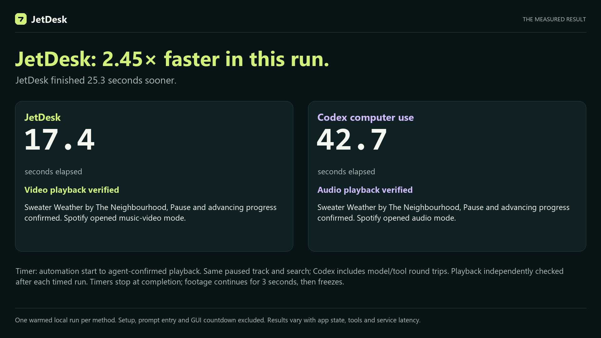

# JetDesk

JetDesk is a native Windows application for fast computer use, powered by Jev. It observes UI Automation controls, asks Jev to choose an operation, executes it, and observes the new state. There is no generative LLM or Codex dependency at runtime.

## Demo

[](docs/demo/jetdesk-vs-codex.mp4)

**[Watch the 60-second demo](docs/demo/jetdesk-vs-codex.mp4)** — JetDesk completed this recorded task in **17.4 seconds**; Codex Computer Use took **42.7 seconds**, or **2.45× as long**. The video shows both runs side by side at real speed.

One warmed run per workflow: JetDesk used **Jev 1.13.0**; Codex used **gpt-6-astra with ultra reasoning**. Both reached verified visible playback. JetDesk played the music video; Codex played the audio track. Setup, request entry, and the JetDesk GUI countdown are excluded. See the [methodology and limitations](docs/demo/METHODOLOGY.md).

## Run

After cloning, install the .NET 8 SDK or newer and run `./Build.ps1` from this folder to create **app/JetDesk.exe**. Build output and local logs are excluded from Git.

1. Open **app/JetDesk.exe** (or double-click **Start JetDesk.cmd**).
2. Enter a request, for example **play sweater weather on spotify**.
3. Leave **Start in** on Automatic, or select an existing application.
4. Choose an operation limit (default **50**) and click **Run request**.
5. Use **Stop** or **F8** to cancel. Avoid typing or moving the target window while a run is active.

The app reads `JEV_KEY` from the current process environment, then the Windows user environment, then the machine environment. Your existing Windows user variable works without re-entering the key. The key is sent only in the authorization header to `https://api.typesafe.ai/v1/systemone`; it is never displayed or written to logs.

The app requires the .NET 8 Desktop Runtime on Windows. It runs with the current user's privileges. Target applications running as administrator may not be accessible from a non-elevated app.

## What it does

- Reads the selected window's control names, roles, values, enabled/selection/toggle state, bounds, and supported operations through Windows UI Automation.
- Offers Jev actual observed controls, open windows, and installed applications as typed choices.
- Supports invoking controls, setting text, selecting, toggling, expanding, scrolling, fixed keyboard shortcuts, switching windows, launching observed apps, and waiting.
- Uses UI Automation operations first, with checked mouse/keyboard fallbacks. Target coordinates and control identities are revalidated before input.
- Builds text candidates from quoted text, request phrases, observed labels, and a few fixed search templates. Jev selects a candidate ID; it cannot invent an arbitrary string or shell command.
- Refreshes the screen after each action and checks with Jev whether the goal is achieved before choosing another input. A completion suggestion triggers another fresh observation and verification. Reaching the operation limit also checks the final action's result.
- Stops on completion, operation limit, cancellation, an API error, repeated ineffective actions, or Jev reporting that it cannot proceed.

Jev is a probabilistic classifier. A valid typed response is not a guarantee that the selected action or completion judgment is correct. The app records the evidence so a result can be inspected.

## Coverage and data

This version uses UI Automation, not screenshot OCR. It works with applications that expose accessible controls, including the Spotify desktop app tested here. Custom-drawn canvases, games, remote-desktop image surfaces, and inaccessible controls may require a future OCR/vision adapter. Search and literal text entry are supported; arbitrary prose generation is not.

The active window's observed text, the request, relevant action history, and offered window/app names are sent to TypeSafe. Password controls are excluded from model input. Local JSONL logs include requests, observations, decisions, action outcomes, and completion checks, but no API keys. Logs may contain other visible application data; they stay in **app/logs** until you remove them.

The app uses `jev-latest`; each decision records the concrete model returned by the API. Input confidence and completion thresholds are in source (`RunOptions.MinimumConfidence` and `JevClient.CompletionThreshold`). Large trees are bounded and the model receives a relevance-ranked subset; not every possible control is available on every turn.

Dense observations use compact choice labels. If Jev specifically reports that its context limit was exceeded, the client retries the same observation with a smaller ranked subset before executing any input; other HTTP 400 errors are not treated as context-limit retries.

## Command line

```powershell
.\app\JetDesk.exe --list-windows --result windows.json
.\app\JetDesk.exe --observe --window 123456 --result screen.json
.\app\JetDesk.exe --run "play sweater weather on spotify" --max-operations 50 --result result.json
```

Additional options: `--window HWND`, `--log-dir PATH`, and `--cancel-after-seconds N`. Use `Start-Process -Wait` or the returned process handle when scripting this Windows GUI executable; interactive shells can return before GUI processes finish. `--result` writes a terminal JSON result. Exit codes: 0 completed; 2 stopped or operation limit; 1 error or needs attention.

## Build and verification

Run **Build.ps1** with the .NET 8 SDK or newer. The application project is **src/JetDesk.csproj**. No third-party NuGet dependencies are required.

```powershell
dotnet run --project tests/client/ClientTests.csproj -c Release
```

See **tests/verification-plan.md** and **VERIFICATION.md** for the difference between deterministic tests, live API checks, the controlled native test window, and real Spotify testing. The controlled music window simulates playback; Spotify verification is separate.
